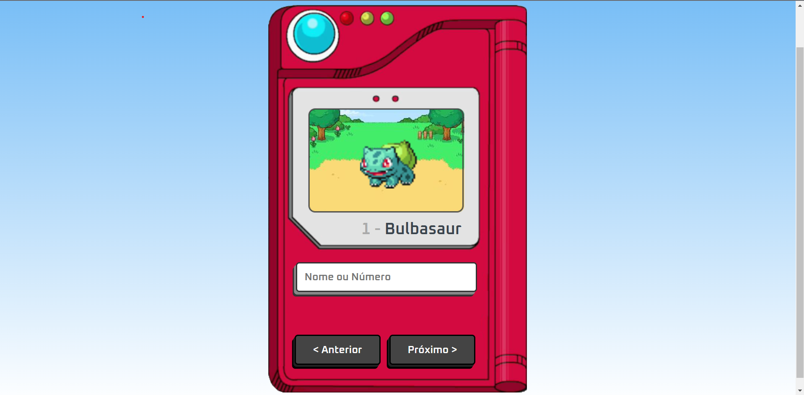
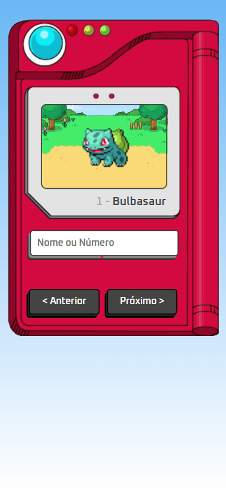
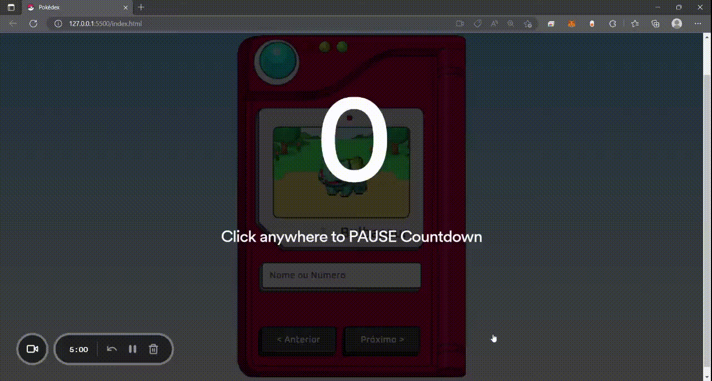

# 📋 Projeto Pokédex

## 💎 Introdução

O projeto que você verá a seguir consiste em uma Pokedéx, o qual resolvi construir com base no tutorial do Manual do Dev para aprender a implementação e manipulação de APIs. 
 
A API utilizada foi a PokeAPI, uma API gratuita que fornece todos os dados dos pokémons.
 
Em breve serão realizadas atualizações com upgrades no projeto, como a implementação de cards para a visualização de mais atributos dos pokémons, entre outros. Espero que goste! 
 
Você pode visualizar o projeto em seu computador clicando <a href="https://kauanbrt.github.io/Pokedex/" >AQUI</a>

## 💻 Layout Web

## 📱 Layout Mobile

## 🎥 Animação

# ✅ Tecnologias
* HTML 5
* CSS 3
* JavaScript

# 📝 Autor
https://www.linkedin.com/in/kauan-borotto-7904401a3/